# Enterprise Active Directory Lab

## Project Overview
This project demonstrates building a complete enterprise environment using **Windows Server 2022 Evaluation Datacenter**. The main goal is to convert a standalone server into a Domain Controller and File Server using PowerShell scripts, while managing and securing client workstations through Group Policy (GPO).

---

## Lab Environment
* **Server OS:** Windows Server 2022 Evaluation Datacenter.
* **Client OS:** Windows 11 Pro.
* **Platform:** Oracle VirtualBox.
* **Tools:** * PowerShell CLI (Automation)
  * Active Directory Users and Computers (ADUC)
  * Group Policy Management (GPMC)

---

### 1. PowerShell Scripts
* **Path:** [scripts](./scripts/)

- [Install-DS-DC-Role.ps1](./scripts/Install-DS-DC-Role.ps1): Automates AD DS installation and Domain Controller promotion.  
- [Install-FileServer-Role.ps1](./scripts/Install-FileServer-Role.ps1): Automates File Server role setup, folder creation, and NTFS permissions.

---

### 2. GPO Reports & Policy Results
* **Path:** [gpo-reports](./gpo-reports/)

**Included Reports:**

- IT Department: [it-gpo-report.html](./gpo-reports/it-gpo-report.html)
- HR Department: [hr-gpo-report.html](./gpo-reports/hr-gpo-report.html)
- Finance Department: [finance-gpo-report.html](./gpo-reports/finance-gpo-report.html)
- Security Audit Policies: [security-audit-gpo-results.html](./gpo-reports/security-audit-gpo-results.html)

**These reports include:**

- Applied Group Policies
- Security Restrictions
- Audit Policy Configuration
- GPO Application Status

---

## Implementation Phases (Technical Showcase)

### Phase 1: Setup & Domain Integration
Preparing the infrastructure and connecting devices.

1. **Virtual Machines:** Setup of Server 2022 and Windows 11 Pro.
   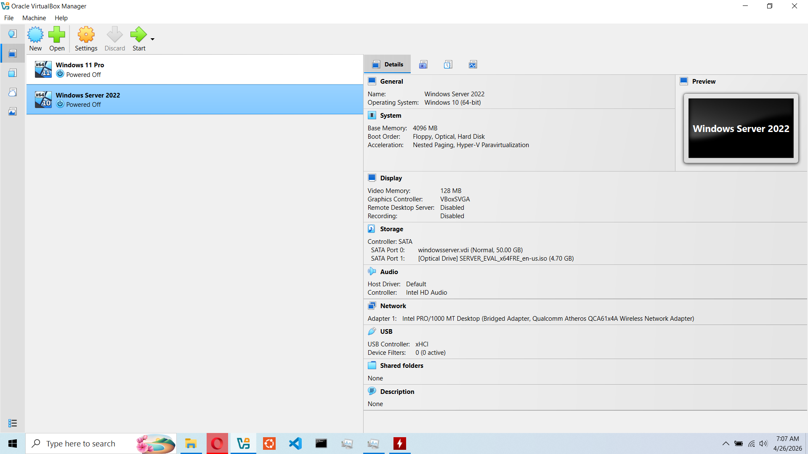
2. **AD Installation:** Installing Active Directory using the automation script.
   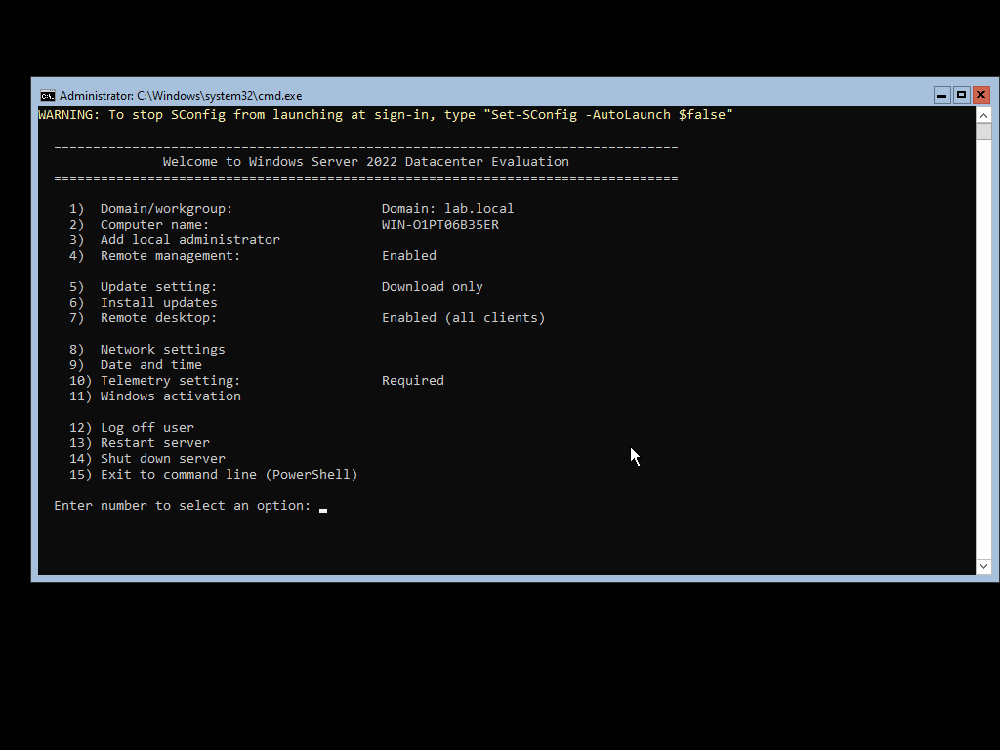
3. **Join Domain:** Successfully joining the Windows 11 workstation to the `lab.local` domain.
   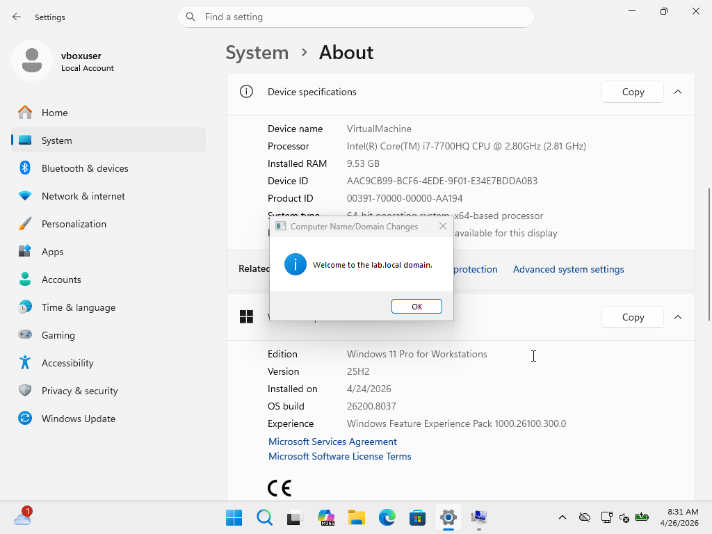

---

### Phase 2: Directory & Automation
Organizing the structure and automating tasks.

4. **OU Structure:** Creating Organizational Units for (IT, HR, and Finance) viewed in **ADUC**.
   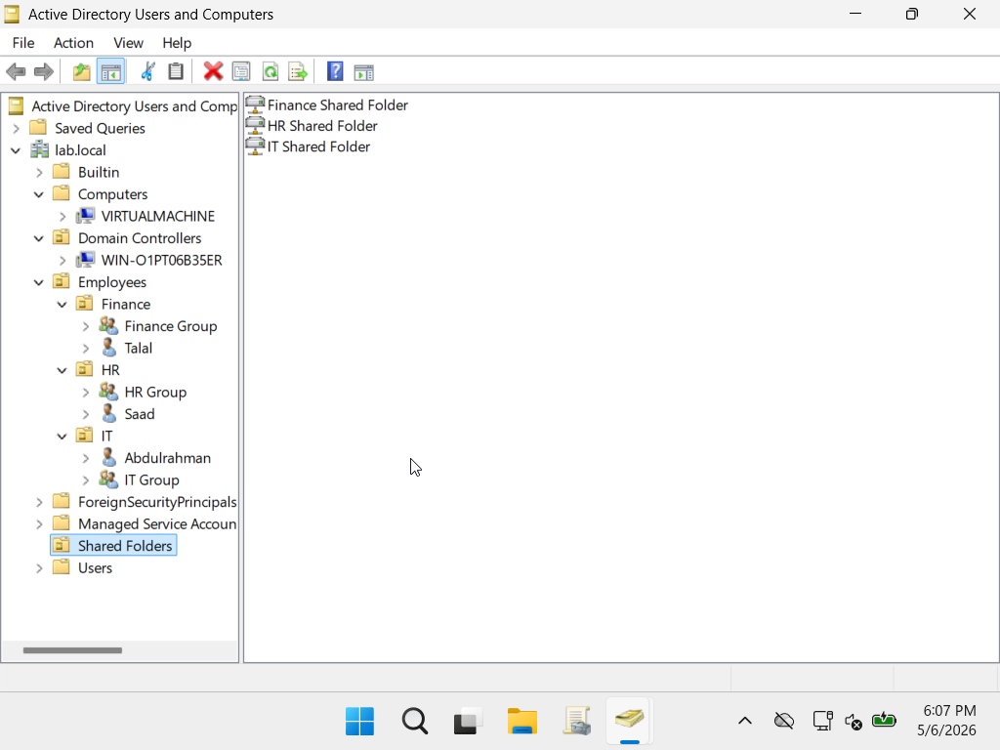
5. **Departmental Folders:** Verification of the automated folder creation for each department:
   * **IT Department:** 
   * **HR Department:** 
   * **Finance Department:** 
6. **Folder Permissions:** Results of the script applying NTFS permissions and sharing settings.
   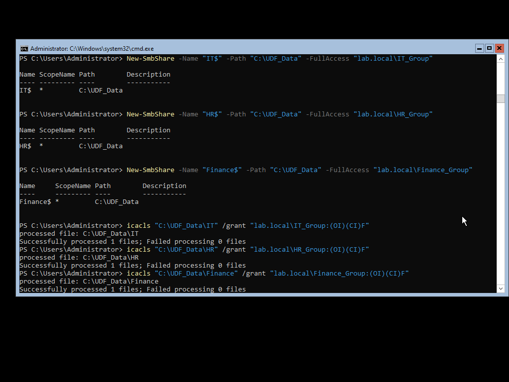
7. **User Creation:** Verification of user accounts created within their respective OUs in **ADUC**.
   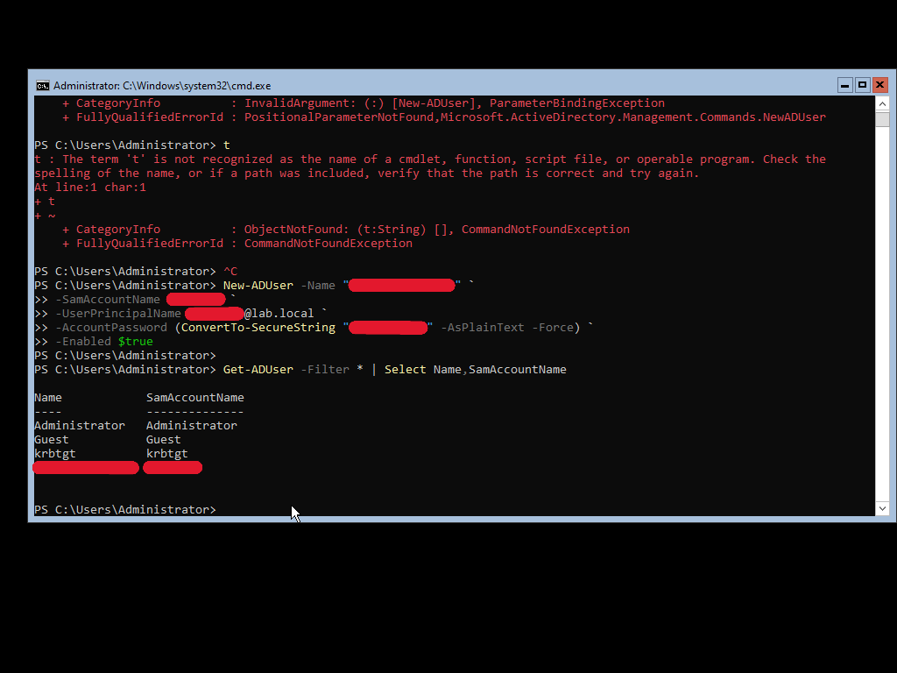
8. **Password Management:** Managing user credentials via PowerShell CLI.
   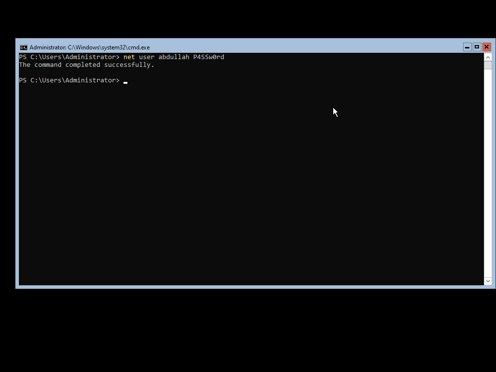

---

### Phase 3: Policy Enforcement & User Environment
Securing the system and preparing the user workspace.

9. **GPO Management:** Overview of the applied Group Policies in GPMC.
   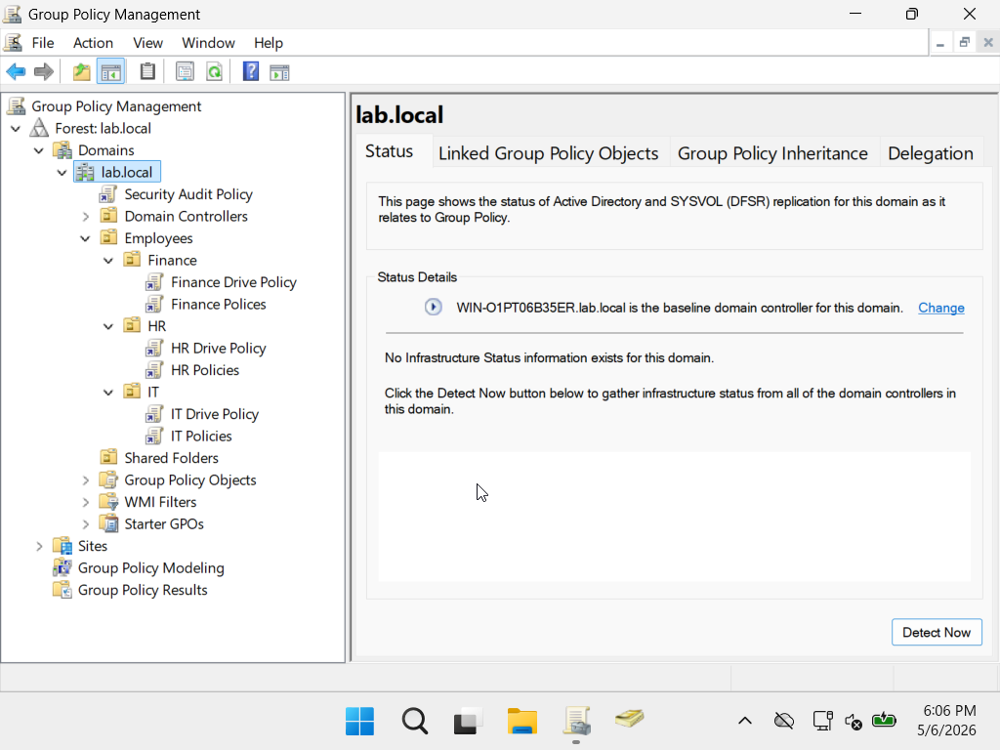
10. **Policy Refresh:** Forcing GPO updates on the client side using `gpupdate /force`.
    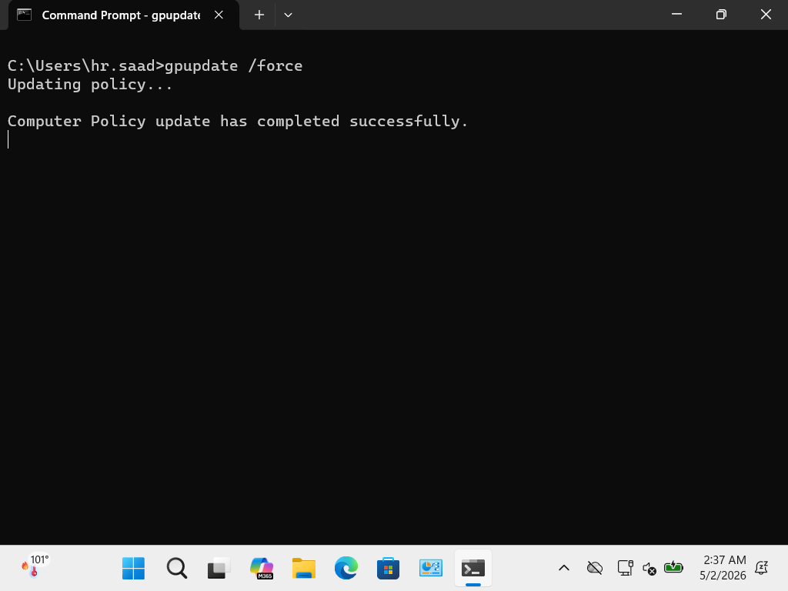
11. **CMD Block:** Restricted access to the Command Prompt for standard users.
    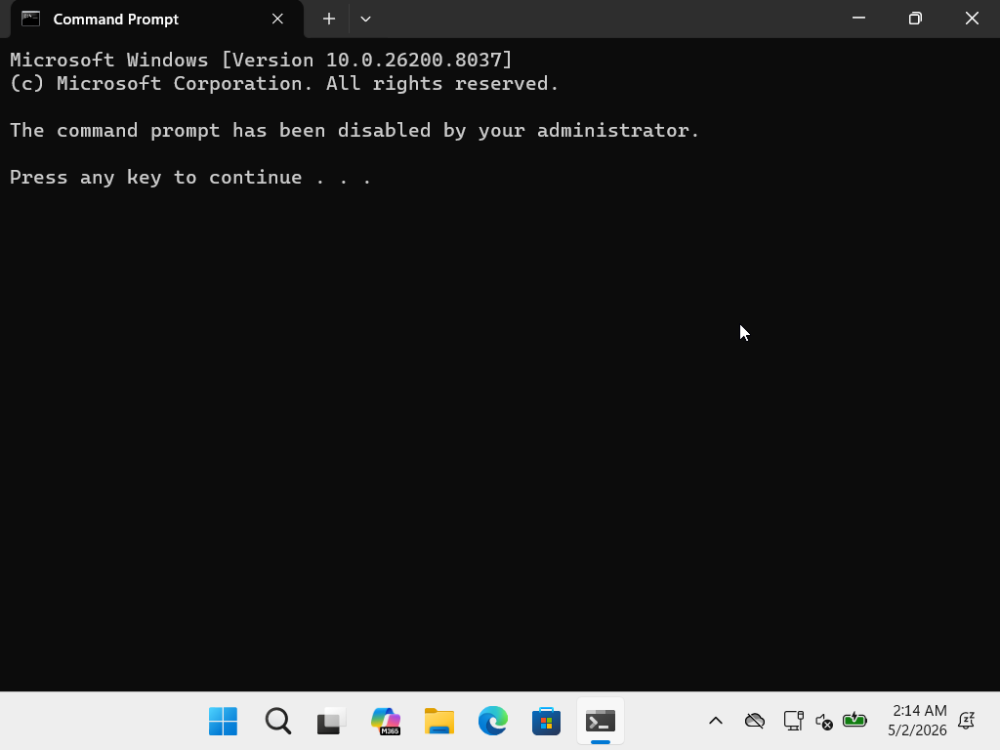
12. **Control Panel Block:** Disabled access to system settings via GPO.
    
13. **Mapped Drives:** Automatically mapping department network drives (Z: Drive) upon login.
    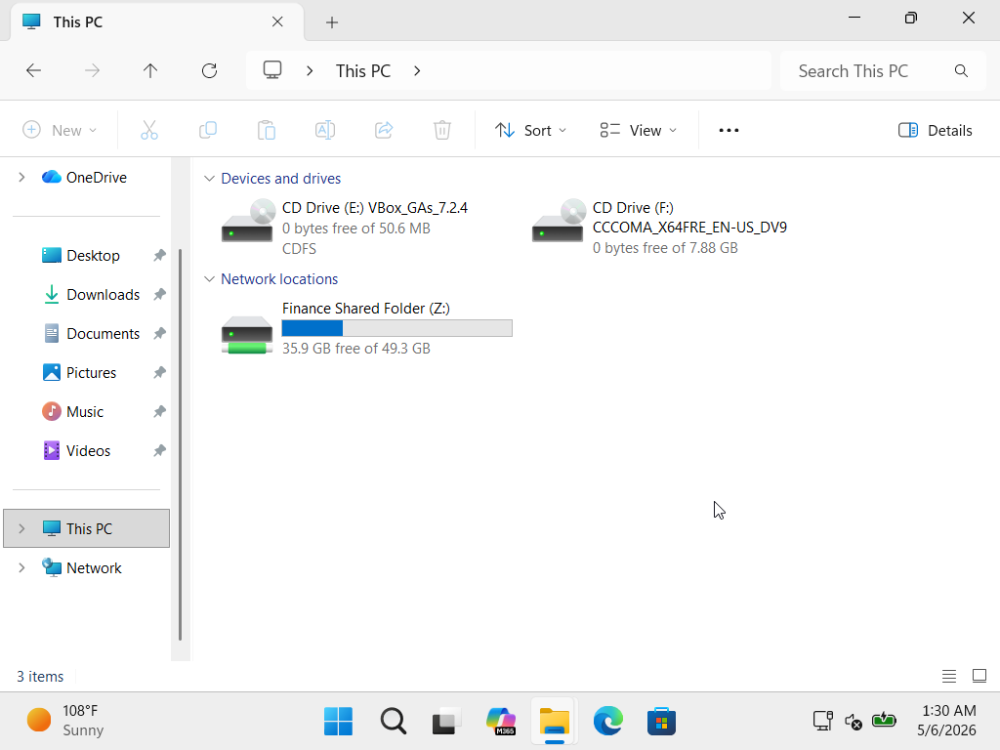

---

### Phase 4: Security Monitoring
Tracking system events and administrative activity.

14. **Security Logs:** Enabling process creation auditing (Event ID 4688) to monitor system activity.
    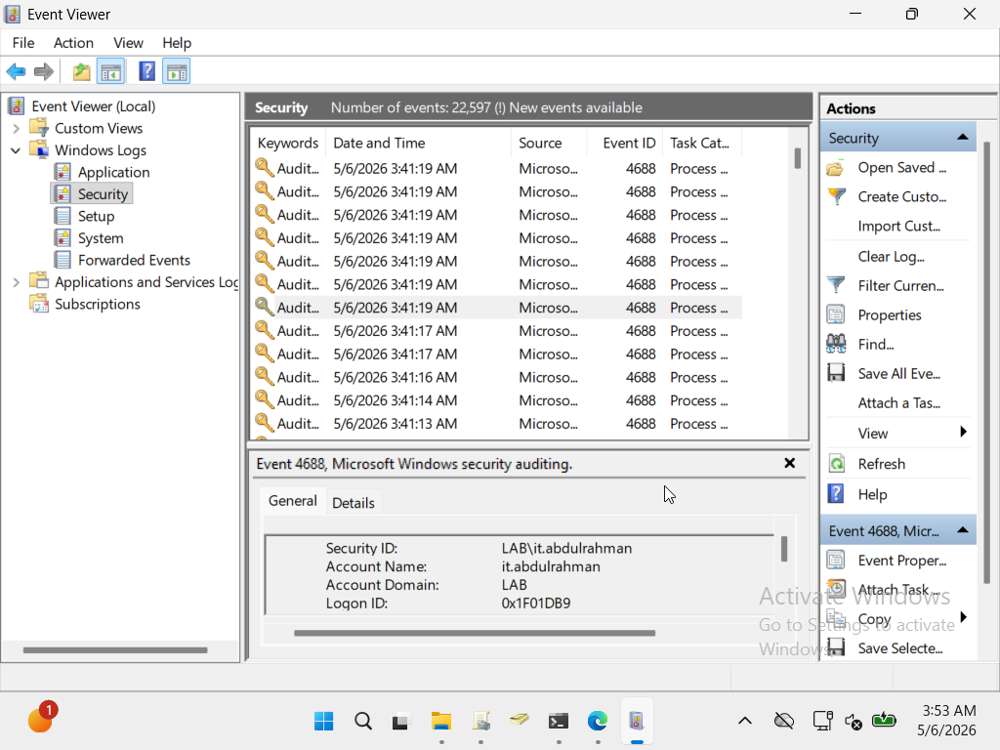

---

## Project Outcomes
1. **Efficiency through Automation:** Reduced setup time by using PowerShell scripts for server promotion and file sharing instead of manual configuration.
2. **Centralized Management:** Gained full control over all users, permissions, and devices from a single administrative point using **ADUC** and **GPMC**.
3. **Enhanced Security:** Hardened the environment by disabling sensitive tools (CMD/Control Panel) and enabling detailed activity logging.
4. **Optimized User Experience:** Ensured users have immediate access to their departmental files and a standardized, secure workspace upon login.
